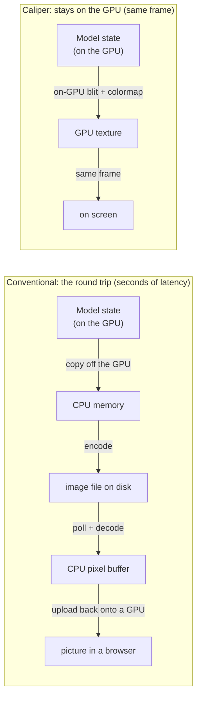
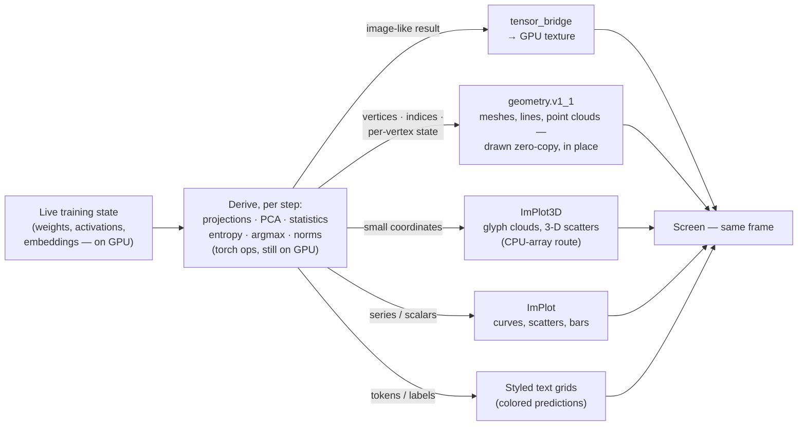
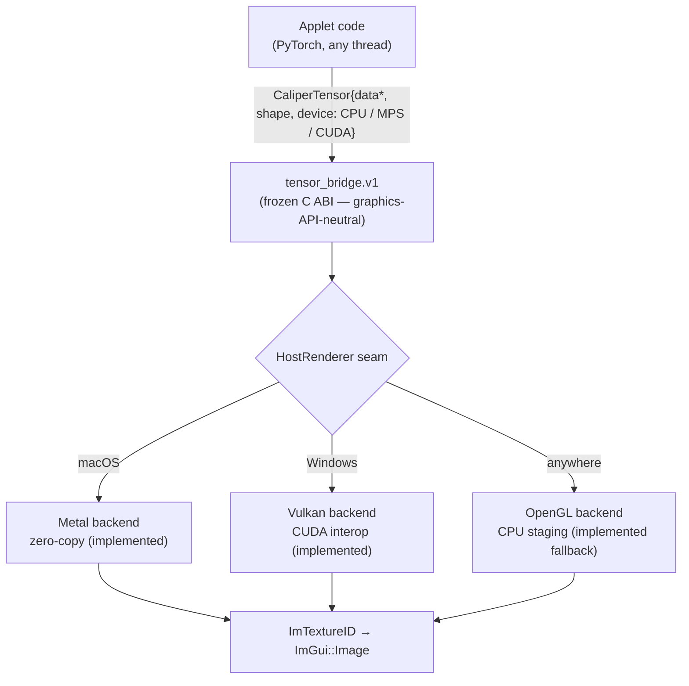
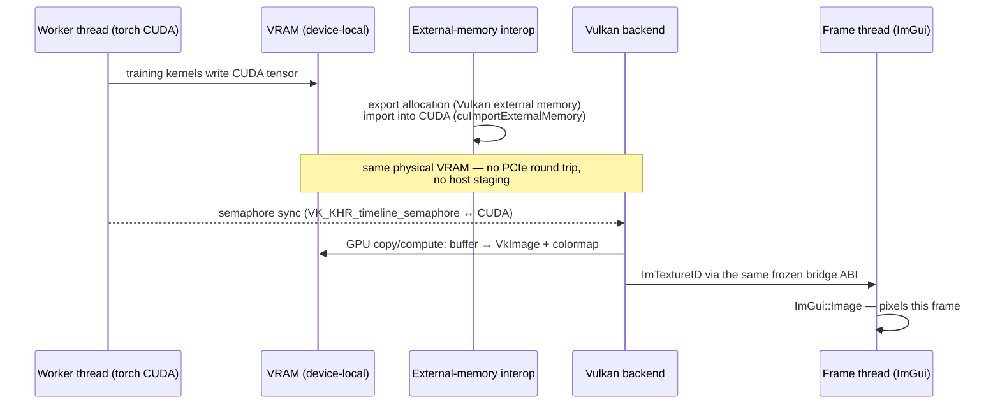

# Watching Models Learn: Eliminating the Round Trip Between Training and Seeing

**Whitepaper draft — v0.2** *(v0.1 + §4/§9 geometry rewrite: coordinate-style
graphics are no longer CPU-array-only — `caliper.geometry.v1_1` makes meshes,
lines, and point clouds a zero-copy class on both ecosystems)*
*Ahmed Khan · July 2026*

> **One-sentence thesis.** Every mainstream tool for looking inside a neural
> network while it trains copies the data off the GPU, through the CPU, usually
> onto disk, and back onto a GPU inside a browser — a round trip measured in
> seconds; Caliper deletes that round trip, so the model's internal state is
> drawn on screen *in the same frame it was computed*, and this is verified
> pixel-exact on both of the dominant hardware ecosystems (Apple Silicon and
> Windows/NVIDIA).

---

## How to read this paper

| You are | Read | You will come away with |
|---|---|---|
| **General reader / non-technical** | §1, §2, §4 | Why "watching a model learn, live" was impossible yesterday and what it looks like today |
| **Business / product / investment** | §1, §2, §4, §5 | What the round trip costs in GPU-hours, engineer-hours, and infrastructure — and why deleting it is defensible |
| **Research / engineering** | §1, §3, §6–§9, appendices | The mechanism (memory aliasing, external-memory interop, the sync ladder), the verification method, and the honest limits |

Every section is self-contained; no section assumes you read the deeper ones.

---

## 1. Executive summary

Training a neural network is the most instrumented-*around* and least
instrumented-*inside* process in modern computing. We log the loss, the
learning rate, the GPU temperature — everything **about** the run — while the
thing actually being made, the model's internal state, sits on the GPU in a
form nobody looks at until the run is over, or at best minutes behind.

The reason is mechanical, not conceptual. The internal state lives in GPU
memory. Every mainstream visualization tool (TensorBoard and its descendants)
gets it to your eyes by: copying it to CPU memory, encoding it to an image
file, writing that to disk, polling the file from a web server, decoding it in
a browser, and uploading it *back onto a GPU* to display. Two bus crossings,
one filesystem, one encode/decode, seconds of latency — for data that started
out already on the chip that renders your screen.

**Caliper removes the round trip.** The tensor's bytes never leave the GPU and
are never staged through CPU memory. On Apple Silicon, the training
framework's tensor and the renderer's texture are *the same physical memory*
(unified memory makes this a pointer cast, plus safety rules that make the
cast honest). On Windows/NVIDIA, compute and graphics APIs are made to share
one VRAM allocation via external-memory interop, synchronized by GPU-side
timeline semaphores — no CPU thread waits on the hot path. In both cases the
result is on screen **the same frame it was computed**, which is what makes
watching weights reorganize at 60 fps — every optimizer step, not every
checkpoint — possible at all.

Three claims, one per audience:

- **For the curious reader:** this turns training from developing photographs
  into watching a live video feed — you *see* a network sort a cloud of
  handwritten digits into ten colored lobes as it learns, in real time.
- **For the business reader:** the round trip is paid in wasted GPU-hours
  (failures discovered late), engineer time (log-out, load-in-a-notebook
  archaeology), and infrastructure (a logging server, a browser stack, disk
  churn). Caliper is a native desktop application with none of that footprint,
  and it runs on both hardware ecosystems that matter.
- **For the researcher:** in-the-loop, per-step observability is a new
  instrument class for interpretability — logit lenses, attention-head
  specialization trajectories, and embedding-space dynamics rendered live
  during training rather than reconstructed afterward. Every claim in this
  paper is backed by a pixel-exact automated test against a CPU reference, on
  real hardware, on both platforms.

---

## 2. The problem, in plain terms

*(Primary audience: everyone. This section deliberately contains no API names.)*

A neural network learns by adjusting millions of internal numbers, thousands
of times per minute. Those numbers have structure — early vision filters
literally *look like* edge detectors; a language model's attention heads
develop visible specializations. Watching that structure emerge is not a
luxury; it is often the fastest way to know whether a run is healthy, and for
a researcher it is the phenomenon under study itself.

But here is what "watching" actually involves today, against what this paper
proposes:



It is as if a security camera worked by printing each frame, mailing the
photograph, and scanning it at the other end. The picture arrives; the *event*
is long over. In practice this means researchers sample sparsely (every N
minutes, every epoch), and whole categories of fast dynamics — what happens in
the first two hundred optimizer steps, how a representation reorganizes during
a loss spike — are simply never seen by anyone.

The strange part: the data starts out on the same class of chip that draws
your screen. The round trip exists not because physics demands it, but because
the software worlds of *computing* on a GPU and *drawing* with a GPU grew up
separately and rarely share memory. That accident of history is the entire
problem Caliper solves.

**What "solved" looks like:** you click *Train* and watch a three-dimensional
cloud of 2,000 handwritten digits — positioned by the network's own internal
representation — split from one gray blob into ten colored lobes as the model
learns to tell digits apart. Rotatable with a mouse, updating live, on a
laptop. No server. No browser. No files.

---

## 3. Why nobody fixed this before

*(Primary audience: technical readers; business readers get the moat argument
in §5. This section is what separates an external paper from internal docs —
it must establish that the problem is genuinely hard, not merely neglected.)*

Three walls stand between a training loop and a rendered pixel, and each one
independently forces the CPU round trip in existing tools:

1. **The API wall.** Compute frameworks speak CUDA/MPS; renderers speak
   Vulkan/Metal/OpenGL. These APIs historically could not reference each
   other's memory. The escape hatches — unified memory on Apple Silicon,
   `VK_KHR_external_memory` + CUDA interop on NVIDIA — are recent, fiddly,
   platform-specific, and rarely used outside game engines.
2. **The process wall.** The standard tooling architecture puts visualization
   in a *different process* (a web server) and often a different machine. Once
   you cross a process boundary, you are serializing; once you serialize
   GPU-resident data, the round trip is already lost.
3. **The correctness wall.** Sharing memory between a training framework that
   is *still writing* and a renderer that is *reading* is a race by default.
   Getting it wrong doesn't crash politely; it renders yesterday's bytes or
   corrupts command streams. (We hit both — §8 documents the two races and the
   rules that survived them.)

Each wall has a known workaround; the contribution is an architecture in which
all three are crossed *at once*, portably, behind a contract small enough to
freeze. That is why the answer is a platform and not a patch to TensorBoard.

---

## 4. What it makes possible

*(Primary audience: everyone — this is the payoff section, and it is
deliberately placed before any mechanism. Screenshots/short clips go here in
the published version; each example below exists and runs today.)*

The narrow reading of "tensor visualization" is heatmaps. The consequential
reading is: **the model's live internal state is in the same address space as
a renderer**, so an applet can compute *any* transformation of it — on the
GPU, mid-training — and draw the result the same frame. The tensor is the
source; the visualization is derived:



- **EmbedScope — geometry of learning.** A digit-classifier with a 3-neuron
  bottleneck; its activations *are* 3-D coordinates. Two thousand test digits
  render as a live point cloud that visibly reorganizes from one blob into ten
  lobes as training runs. Hovering any point shows that digit's image and the
  model's current guess.
- **GPTScope — a language model, transparent.** A small GPT trains live on
  Shakespeare. Attention heads render as sharpening heatmaps; sixteen heads
  reduce to two derived statistics and migrate across a scatter plot as they
  specialize; a logit lens renders "when does the model decide?" as a colored
  text grid; generated samples evolve from gibberish to iambic cadence over
  three minutes.
- **MeshScope — the model's output as a solid, live.** A small network learns
  a 2-D surface; every optimizer step writes its prediction into GPU memory
  the renderer draws **in place** — a Lambert-lit, loss-colored mesh with a
  wireframe overlay, with zero copies of the geometry ever made. Paint on the
  target with the mouse and the net visibly chases the edit. The same applet
  binary draws zero-copy on both ecosystems (Metal + MPS, Vulkan + CUDA) —
  the exemplar of the geometry class, joined by FlowScope (a million-particle
  flow field, points drawn from the tensor the simulation writes) and
  GPTScope's ThoughtSpace (the residual stream as a live 3-D constellation).
- **Per-step surfaces.** Convolution kernels and projection matrices update
  ~8 times per second — every optimizer step, not every eval — because the
  cost of showing a tensor no longer includes a trip through the CPU.

Two properties make these more than demos:

- **Identical code, three backends.** The same applet binary renders via
  zero-copy Metal on a Mac, Vulkan/CUDA interop on a Windows/NVIDIA machine,
  and a CPU-staged OpenGL fallback anywhere else. The worst case is a working
  slow path, never a broken one.
- **Honest labeling.** The status line tells you which path ran
  ("GPU-resident — zero CPU staging" vs "CPU-staged fallback"). The system
  never claims a fast path it didn't take.

---

## 5. The business significance

*(Primary audience: business. The argument is cost-of-blindness + deleted
infrastructure + portability = market coverage, with verification as the
de-risking close.)*

**The cost of training blind.** GPU time is the dominant marginal cost of
model development, and the most expensive failure mode is the one discovered
late: a run that was doomed at step 500 but ran for twelve hours because
nobody could see inside it. Sparse, laggy observability is not an
inconvenience — it is a multiplier on every failed run. Same-frame
visualization moves failure detection from *post-mortem* to *while it is
happening*, on the developer's own machine.

**Deleted infrastructure.** The incumbent architecture is a logging library +
a disk format + a server process + a browser stack. Caliper is one native
application; the visualization "pipeline" is a function call. For teams, that
is a support surface and a security surface that simply ceases to exist; for
laptops-and-workstations development (where an increasing share of iteration
happens, especially on Apple Silicon), it is the difference between tooling
you run and tooling you *are running a service for*.

**Portability as market coverage.** The two hardware ecosystems that matter —
Apple Silicon for local development, NVIDIA for serious training — have
*opposite* memory architectures (unified vs. discrete). Caliper's contract
never names a graphics API, which is why the NVIDIA implementation landed
without changing a single applet, and why the same argument extends to future
backends. A competitor must solve both memory models *and* reproduce the
frozen-contract discipline to match the portability claim.

**De-risked, not promised.** Every rendering path is verified byte-for-byte
against a CPU reference implementation by automated tests on real hardware on
both platforms. "It works on both" is a CI gate, not a roadmap item.

*(Deliberately out of scope for v0.1 of this draft: pricing/packaging, cloud
story, team-scale collaboration. Flag for a later revision once positioning
is decided.)*

---

## 6. The solution architecture

*(Primary audience: research/engineering. From here down the paper earns the
claims made above. Tone shift is intentional and announced by the structure.)*

### 6.1 One contract, three backends

Applets — the visualization programs — never touch a graphics API. They fill
a plain C struct (`CaliperTensor`: data pointer, shape, strides, dtype, and a
`device` field saying where the bytes live) and hand it to a frozen service
ABI, `tensor_bridge.v1`. Behind the host's renderer seam, a backend turns it
into a texture however that platform does it best:



| Backend | Mechanism | Data crossings |
|---|---|---|
| Metal / MPS (Apple Silicon) | unified memory: the tensor's storage *is* an `MTLBuffer`; handoff is a pointer cast + safety rules | 0 host copies; 1 on-GPU blit |
| Vulkan / CUDA (Windows/NVIDIA), arbitrary tensor | Vulkan exports a VRAM buffer, CUDA imports it; one in-VRAM `cuMemcpyDtoD`; buffer→image pass | 0 host copies; 1 in-VRAM copy |
| Vulkan / CUDA, `alloc_shared` | the tensor's backing store *is* the interop buffer; kernels write texture memory in place | 0 host copies; **0 in-VRAM copies** |
| OpenGL / CPU (anywhere) | CPU colormap + one texture upload | 1 host staging + 1 upload |

The returned texture id casts directly to an `ImTextureID`; the applet draws
it with `ImGui::Image` in the same frame.

**Definition discipline.** "Zero-copy" in this paper means: the tensor's
*data* never leaves the GPU and never transits host memory. One GPU-side
buffer→texture pass remains (samplers read textures, not raw buffers); it runs
at memory bandwidth, on-device. For an *arbitrary* framework-allocated CUDA
tensor, one in-VRAM copy is the floor (the framework's caching allocator does
not produce exportable allocations); the literal zero-copy rung is
`alloc_shared`, where training kernels write the texture's own backing memory.
The paper — like the product's status lines — reserves each label for the path
that earns it.

### 6.2 Apple Silicon: aliasing under unified memory

CPU and GPU share one pool of physical RAM, so a PyTorch MPS tensor's storage
already is the object Metal renders from. What makes the cast *safe* rather
than merely possible: the frozen struct has no storage-offset channel, so the
adapter **rejects** non-contiguous tensors and views with nonzero storage
offsets rather than silently copying or — worse — silently addressing the
wrong texels. Repairs (`.contiguous()`, `.clone()`) happen in applet code,
where their cost is visible. A GPU compute pass applies colormaps for float
heatmaps; a blit path handles direct RGBA.

```mermaid
sequenceDiagram
    participant W as Worker thread (torch MPS)
    participant U as Unified memory (one physical RAM)
    participant B as Bridge (Metal backend)
    participant F as Frame thread (ImGui)

    W->>U: training kernels write weight MTLBuffer
    W->>W: tensor.contiguous(), storage_offset == 0
    W->>B: hand over pointer — cast straight to the MTLBuffer, zero bytes moved
    Note over W,B: handoff sync: v1 drains (torch::mps::synchronize); with bridge-v1.1 stream handoff the renderer GPU-orders<br/>after the producer queue instead (§7)
    B->>U: GPU blit encoder: buffer → MTLTexture<br/>+ colormap LUT applied on-GPU (f32 heatmaps)
    B->>F: ImTextureID (the texture, directly drawable)
    F->>F: ImGui::Image — pixels this frame
```

### 6.3 Windows/NVIDIA: external-memory interop

Discrete GPUs separate VRAM from system RAM, so zero-copy means *keep it in
VRAM and make the two APIs share the allocation*. The direction is the
non-obvious part: the **renderer exports** (Vulkan external memory, opaque
Win32 handle) and **CUDA imports** — because the training framework's
allocator can't export. Device pairing is UUID-driven (the Vulkan device and
CUDA device must be the same physical silicon; a hybrid-GPU mismatch disables
interop rather than corrupting). Colormapping runs as a SPIR-V compute pass
byte-identical to the CPU reference. The host loads the CUDA *driver* API at
runtime from the system's own driver — no CUDA toolkit dependency; machines
without NVIDIA hardware build and run unchanged.



### 6.4 The degradation ladder

Every acceptance failure — foreign device, non-contiguous layout, absent
interop, exotic allocator — returns `false` and takes the next rung down,
ending at the CPU-staged path. A failed fast path is a staged frame, never a
crash and never a wrong image. This is why the same applet is demoable on a
MacBook, a gaming PC, and a VM.

---

## 7. Synchronization: the part that bites

*(Primary audience: research/engineering. This section carries the paper's
credibility with systems readers — it is where most naive implementations
die, and we present it races-first.)*

Sharing memory between a producer that is still writing and a consumer that
renders is only correct if *when* is as disciplined as *where*. Caliper's
answer is a two-rung negotiated ladder:

- **v1 — drain.** Synchronize the producer device fully before handoff
  (sync-then-update). Always correct; costs one full-device barrier, paid once
  at the handoff, never per frame.
- **v1.1 — stream-ordered handoff.** The adapter publishes the producer's
  queue/stream in the tensor struct; the renderer GPU-orders its work after
  the producer's (per-texture `MTLSharedEvent` on Metal; a shared timeline
  semaphore riding the producer's CUDA stream on Vulkan). No CPU thread waits
  on the hot path. Hosts advertise the capability; adapters degrade to the
  drain automatically.

Two hard-won findings, offered as cautionary results:

1. **PyTorch's public MPS stream calls are not internally serialized** (we
   established this by disassembly after crashes in three different
   costumes). Handing off while the training thread encodes corrupts
   command-buffer state. All MPS-touching handoff work must run as one block
   on the framework's own stream dispatch queue.
2. **CUDA's thread-safety is contractual — we pinned it anyway.** The MPS
   lesson was precisely that "should be safe" is not evidence; a 500-handoff
   concurrent-training stress test holds the property empirically.

And one honest measurement: eliding the drain did **not** improve training
throughput (≈0 delta on the benchmark machine — the training loop's own
per-step `loss.item()` sync dominates). The verified win is ordering
correctness plus removal of frame-thread stalls. Papers in this genre
routinely imply throughput wins they haven't measured; we measured, and
report what we found.

---

## 8. Verification: pixel-exact or it didn't happen

*(All audiences, one page. For business readers this is the de-risking
section; for researchers it is the methods section.)*

The claim "the GPU path is equivalent to the reference" is a *byte* claim,
tested as one. A single CPU function is the source of truth for
colormapping; every GPU implementation (Metal compute, Metal blit, SPIR-V
compute, Vulkan copy) must read back **byte-identical** output across
adversarial sizes (non-multiple-of-16, ragged shapes), NaN inputs, and
degenerate ranges — in an automated windowed test harness, per backend, every
CI run, including on real NVIDIA hardware. The stream-ordered path adds a
burst test: eight overlapping updates ordered only by semaphores must land
byte-exact. Failure modes are designed to be loud: acceptance violations log
and reject rather than render a plausible-but-wrong image.

---

## 9. Limits and non-claims

*(Research audience explicitly; business audience implicitly — a paper that
states its limits is a paper whose claims can be trusted.)*

- Arbitrary framework-allocated CUDA tensors carry a one in-VRAM-copy floor
  **unless allocated from Caliper's exportable pool, which removes it**; the
  floor persists only for memory born unshareable.
- The v1 contract requires contiguous, offset-0 tensors; views are rejected,
  not repaired.
- Dense outputs (heatmaps, feature maps, attention grids) and geometry
  (point clouds, lines, indexed meshes — `caliper.geometry.v1_1`) both ride
  zero-copy paths, byte-exact-verified on both ecosystems; small derived
  series (curves, scatters, glyph clouds) still flow through plotting
  libraries as CPU arrays — kilobytes, and the routes compose freely.
- Geometry appearance is a fixed menu (flat / colormap / per-vertex color;
  unlit / Lambert; five topologies): applets supply tensors, never shaders.
  Render-to-tensor does not exist and never will — data flows tensors →
  pixels, one way.
- The OpenGL fallback stages through the CPU by design; it exists so the
  worst case is slow, not broken.
- Same-frame visualization does not by itself accelerate training; its value
  is observational (§7's measurement note).
- Single-machine, in-process by design. Remote/cluster training is a
  different problem (and largely re-introduces the round trip that
  distributed tooling rightly accepts); this paper claims the local loop.

---

## 10. Implications and outlook

For the **general reader**: instruments change what gets studied. When the
microscope got a video feed, biology got cell dynamics as a field.

For **business**: the local development loop is where iteration speed
compounds; tooling that deletes seconds from every look-inside changes how
often people look.

For **research**: most interpretability is post-hoc — artifacts of finished
training. Per-step, in-the-loop observation makes *training dynamics*
(representation reorganization, head specialization timing, loss-spike
anatomy) a first-class observable. The platform's applet model means a new
visualization is a new derivation over live state — a torch op and a draw
call — not a new pipeline.

---

## Appendix A — The bridge contract (abridged)

*(Reproduce the `CaliperTensorBridgeV1` struct with the create/update/release
lifecycle and `alloc_shared`, annotated for external readers; note the ABI
never names a graphics API and why that guarantee is load-bearing for
portability.)*

## Appendix B — Verification matrix

*(Table: path × test × hardware × status, distilled from the internal test
documentation. Every row shipped and green as of July 2026.)*

## Appendix C — Glossary for the general reader

*(Tensor, GPU/VRAM, unified memory, texture, frame, interop, semaphore —
one plain-English sentence each.)*
