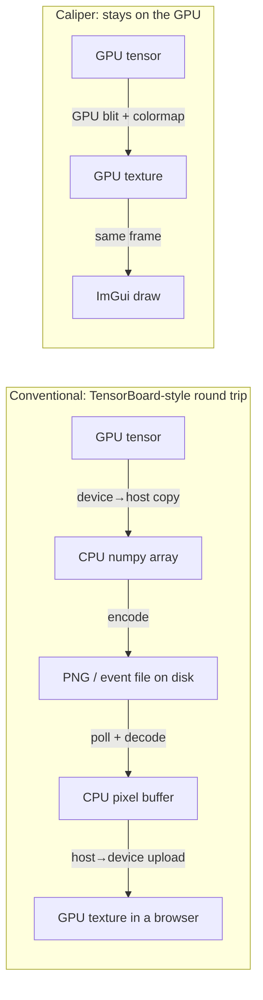
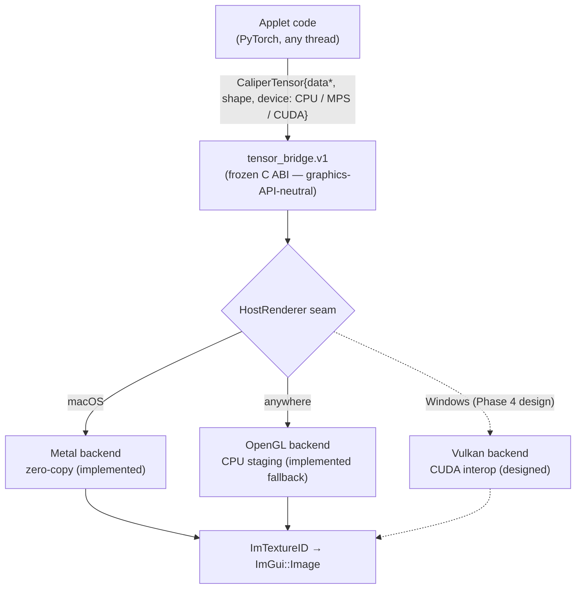
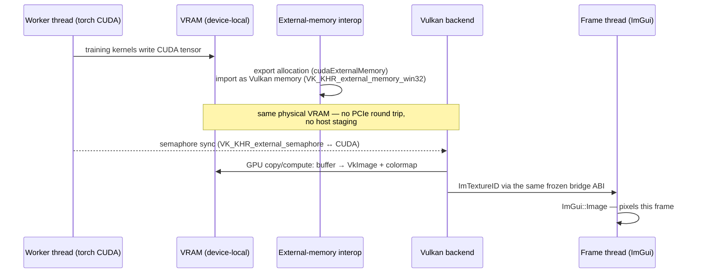
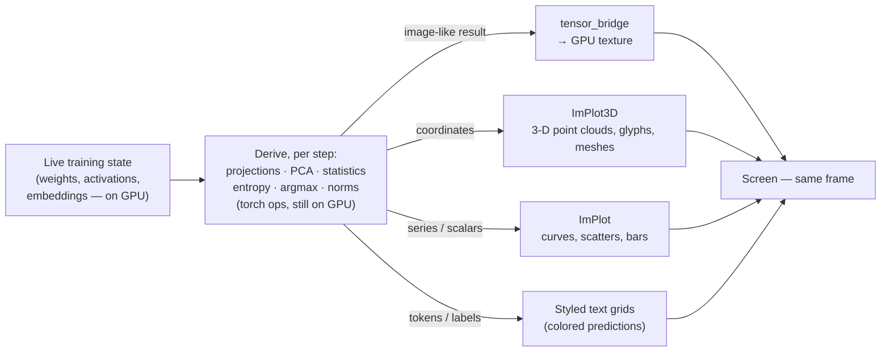

# How zero-copy tensor visualization works

How a tensor goes from a training step to pixels on screen without a CPU
round trip — on Apple Silicon today (implemented, tested), and on
Windows/NVIDIA by design (Phase 4, not yet built). GitHub renders the
diagrams below natively.

**What "zero-copy" means here, precisely:** the tensor's *data* never
leaves the GPU and is never staged through CPU memory. There is still one
GPU-side blit (buffer → texture, required because samplers read textures,
not raw buffers) — but it runs on the GPU at memory bandwidth, not over a
bus into host RAM and back.

**And what it's *for* is bigger than showing tensors.** The texture path
is one output route; the same live pipeline feeds **derived graphics** —
3-D point clouds, learned-coordinate scatters, head-specialization plots,
prediction grids — anything you can compute *from* the training data,
drawn the same frame it was computed. See
[§ Derived graphics](#derived-graphics-not-just-pictures-of-tensors).

## The problem: the round trip everyone else takes

The conventional way to look inside a training run (TensorBoard et al.)
crosses the CPU twice and usually a filesystem once:



The conventional path costs two bus transfers, an encode/decode, and
seconds of latency. The Caliper path costs one on-GPU blit and is visible
**the same frame** — which is what makes per-training-step visualization
(weights reorganizing at 60 fps) possible at all.

## The architecture that makes it portable

Applets never talk to a graphics API. They fill a `CaliperTensor` — a
plain C struct whose `device` field says where the bytes live — and hand
it to the `tensor_bridge.v1` service. A renderer backend behind the host
turns it into a texture however that platform does it best:



The frozen ABI is the reason the Windows path can exist later without
touching a single applet: `CALIPER_DEV_CUDA` is already in the device
enum, and the contract says nothing about Metal.

## Apple Silicon (MPS) — implemented

The enabling hardware fact: Apple Silicon has **unified memory**. CPU and
GPU share one pool of physical RAM, so a PyTorch MPS tensor's storage
*already is* an `MTLBuffer` — the same object Metal renders from. There is
no "GPU memory" to copy out of; the handoff is a pointer cast plus rules
that make the cast safe.

```mermaid
sequenceDiagram
    participant W as Worker thread (torch MPS)
    participant U as Unified memory (one physical RAM)
    participant B as Bridge (Metal backend)
    participant F as Frame thread (ImGui)

    W->>U: training kernels write weight MTLBuffer
    W->>W: tensor.contiguous(), storage_offset == 0
    W->>B: hand over pointer — cast to id&lt;MTLBuffer&gt;, zero bytes moved
    Note over W,B: one torch::mps synchronize at the handoff —<br/>pending kernels finish before the GPU reads
    B->>U: GPU blit encoder: buffer → MTLTexture<br/>+ colormap LUT applied on-GPU (f32 heatmaps)
    B->>F: ImTextureID (the texture, directly drawable)
    F->>F: ImGui::Image — pixels this frame
```

The two safety rules exist because the frozen ABI has no storage-offset
channel: the tensor must be `contiguous()` with `storage_offset() == 0`,
or the buffer cast would address the wrong texels — so the adapter
*rejects* views instead of guessing. Fresh results of GPU ops always
qualify.

Proof, not promise: a windowed test harness pushes known tensors through
this exact path and asserts **pixel-exact** output — on both the Metal and
OpenGL backends, every CI run.

## Windows / NVIDIA — the Phase 4 design (implemented, verification in progress)

Discrete GPUs have no unified memory: VRAM and system RAM are separate,
connected by PCIe. Zero-copy there means something different — **keep the
data in VRAM** and make the compute API and the graphics API share the
same allocation, instead of bouncing through system RAM:



Same shape as the Metal story — write, sync, on-GPU blit, draw — with the
interop machinery (`cudaExternalMemory_t`, `VK_KHR_external_memory`,
shared semaphores) standing in for what unified memory gives Apple for
free.

**Implementation notes (src/host/renderer/vulkan_renderer.cpp):** the
direction is the reverse of the sketch above — the **Vulkan backend
exports** the shared buffer (`VkExportMemoryAllocateInfo`, opaque Win32
handle) and **CUDA imports** it (`cuImportExternalMemory`), because
torch's caching allocator does not produce exportable allocations. The
handoff is one `cuMemcpyDtoD` from the tensor into the shared VRAM
buffer — the "1 in-VRAM copy" the table below always budgeted — followed
by the same buffer → texture pass as Metal (compute colormap for f32,
buffer-to-image copy for u8). Synchronization is the v1 sync-then-update
contract, CUDA form: `torch::cuda::synchronize()` at the adapter,
`cuCtxSynchronize()` after the copy, fence-waited Vulkan submits (Metal's
`waitUntilCompleted`). Shared semaphores remain a later optimization.
The host stays toolkit-free: the CUDA driver API is loaded from
`nvcuda.dll` at runtime (`src/host/cuda_driver.h`), and the Vulkan stack
needs no SDK (volk + in-tree glslang; `vulkan-1.dll` ships with the GPU
driver). **Status: implemented, runtime verification on NVIDIA hardware
in progress; the pixel-exact gfx harness does not yet run a Vulkan env.**
If Vulkan init or interop fails at runtime, Windows falls back to the
OpenGL path (CPU staging): slower, but identical applet code and
identical on-screen results.

## Derived graphics: not just pictures of tensors

The heatmap route (tensor → texture) is the *narrowest* use of this
pipeline. The broader point: because the model's internal state is
reachable **live, in-process, in the same address space as the renderer**,
an applet can run *any transformation* on it — on the GPU, mid-training —
and turn the result into whatever graphic actually carries the insight.
The tensor is the *source*; the visualization is *derived*:



This is exactly how the shipped applets work — each panel is a
*computation over* training state, not a dump of it:

- **EmbedScope's 3-D cloud**: the network has a learned 3-neuron
  bottleneck, so its activations *are* coordinates — 2,000 test digits
  drawn as a rotating ImPlot3D scatter that visibly splits from one blob
  into ten colored lobes as training runs. Nothing "shows a tensor";
  the geometry *is* the model's learned representation.
- **GPTScope's embedding view**: the token-embedding matrix, PCA-projected
  every few seconds, drawn with **each character as its own glyph in 3-D
  space** — you watch vowels find each other.
- **GPTScope's head scatter**: sixteen attention heads reduced to two
  *derived statistics* (mean attended distance × entropy) and plotted as
  migrating points — head specialization as motion, with the raw heatmap
  demoted to an on-click drill-down.
- **GPTScope's logit lens**: residual streams at every depth pushed
  through the unembedding and rendered as a colored text grid — "when
  does the model decide?" as a picture.

So if you want "cool 3-D visualizations of the data being trained": that
is the *intended* use, not a side effect. The recipe is always the same —
derive on the worker (any torch op), publish coordinates or an image-like
tensor, draw with ImPlot3D / ImPlot / the bridge — and the zero-copy
machinery is what makes the whole loop fast enough to run every
optimizer step. One honest nuance: coordinate-style graphics (point
clouds, curves) flow through the plotting libraries as small CPU arrays —
kilobytes, negligible; the zero-copy texture path matters for the *dense*
outputs (heatmaps, feature maps, attention grids), and the two routes
compose freely in one panel.

## The fallback path, for honesty's sake

On the OpenGL backend (or any CPU tensor), the bridge stages through host
memory: colormap on CPU into an RGBA scratch buffer, one `glTexSubImage2D`
upload. Same ABI, same textures, same tests — just with the copy the
other paths avoid. This is what "portable by construction" costs: the
worst case is a working slow path, never a broken one.

| Path | Data crossings | Status |
|---|---|---|
| Metal / MPS (Apple Silicon) | 0 host copies; 1 on-GPU blit | **Implemented + pixel-exact tested** |
| Vulkan / CUDA (Windows) | 0 host copies; 1 in-VRAM copy | Designed (Phase 4), unverified |
| OpenGL / CPU (anywhere) | 1 host staging + 1 upload | Implemented fallback, tested |
