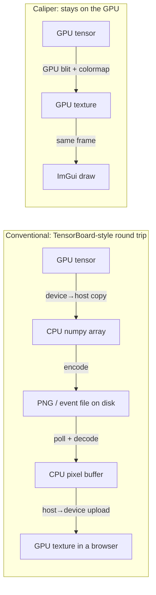
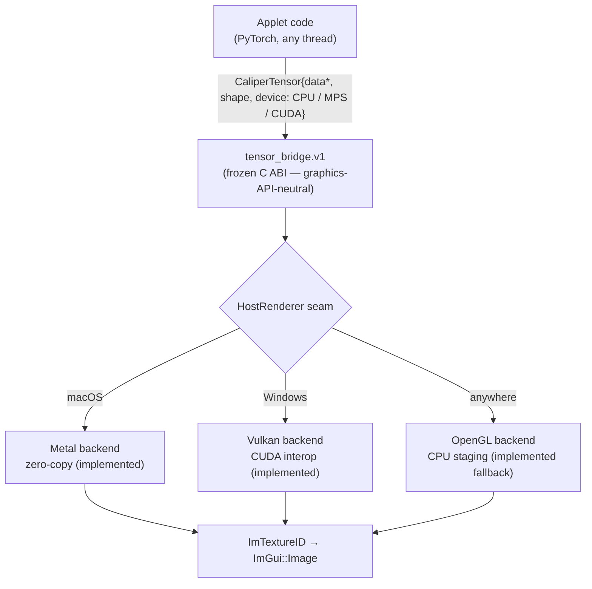
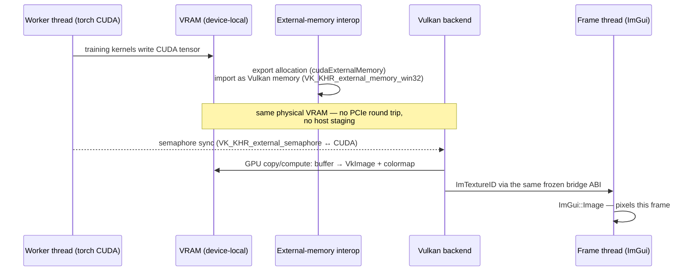
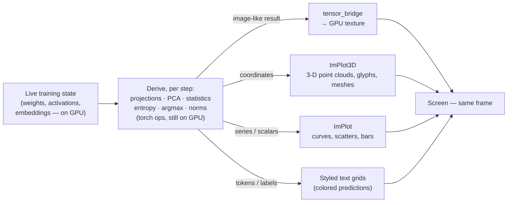

# How zero-copy tensor visualization works

How a tensor goes from a training step to pixels on screen without a CPU
round trip — implemented and hardware-verified on **both** platforms:
Apple Silicon (Metal/MPS) and Windows/NVIDIA (Vulkan/CUDA interop).
GitHub renders the diagrams below natively.

**What "zero-copy" means here, precisely:** the tensor's *data* never
leaves the GPU and is never staged through CPU memory. There is still one
GPU-side blit (buffer → texture, required because samplers read textures,
not raw buffers) — but it runs on the GPU at memory bandwidth, not over a
bus into host RAM and back.

**And what it's *for* is bigger than showing tensors.** The texture path
is one output route; the same live pipeline feeds **derived graphics** —
3-D point clouds, learned-coordinate scatters, head-specialization plots,
prediction grids — anything you can compute *from* the training data,
drawn the same frame it was computed. See
[§ Derived graphics](#derived-graphics-not-just-pictures-of-tensors).

## The problem: the round trip everyone else takes

The conventional way to look inside a training run (TensorBoard et al.)
crosses the CPU twice and usually a filesystem once:



The conventional path costs two bus transfers, an encode/decode, and
seconds of latency. The Caliper path costs one on-GPU blit and is visible
**the same frame** — which is what makes per-training-step visualization
(weights reorganizing at 60 fps) possible at all.

## The architecture that makes it portable

Applets never talk to a graphics API. They fill a `CaliperTensor` — a
plain C struct whose `device` field says where the bytes live — and hand
it to the `tensor_bridge.v1` service. A renderer backend behind the host
turns it into a texture however that platform does it best:



The frozen ABI is the reason the Windows path landed without touching a
single applet: `CALIPER_DEV_CUDA` was in the device enum from day one,
and the contract says nothing about Metal.

## Apple Silicon (MPS) — implemented

The enabling hardware fact: Apple Silicon has **unified memory**. CPU and
GPU share one pool of physical RAM, so a PyTorch MPS tensor's storage
*already is* an `MTLBuffer` — the same object Metal renders from. There is
no "GPU memory" to copy out of; the handoff is a pointer cast plus rules
that make the cast safe.

```mermaid
sequenceDiagram
    participant W as Worker thread (torch MPS)
    participant U as Unified memory (one physical RAM)
    participant B as Bridge (Metal backend)
    participant F as Frame thread (ImGui)

    W->>U: training kernels write weight MTLBuffer
    W->>W: tensor.contiguous(), storage_offset == 0
    W->>B: hand over pointer — cast to id&lt;MTLBuffer&gt;, zero bytes moved
    Note over W,B: handoff sync: v1 drains (torch::mps::synchronize); with bridge-v1.1 stream handoff the renderer GPU-orders<br/>after the producer queue instead (docs/metal-pipelining.md)
    B->>U: GPU blit encoder: buffer → MTLTexture<br/>+ colormap LUT applied on-GPU (f32 heatmaps)
    B->>F: ImTextureID (the texture, directly drawable)
    F->>F: ImGui::Image — pixels this frame
```

The two safety rules exist because the frozen ABI has no storage-offset
channel: the tensor must be `contiguous()` with `storage_offset() == 0`,
or the buffer cast would address the wrong texels — so the adapter
*rejects* views instead of guessing. Fresh results of GPU ops always
qualify.

Proof, not promise: a windowed test harness pushes known tensors through
this exact path and asserts **pixel-exact** output — on both the Metal and
OpenGL backends, every CI run.

## Windows / NVIDIA — implemented, verified on hardware

Discrete GPUs have no unified memory: VRAM and system RAM are separate,
connected by PCIe. Zero-copy there means something different — **keep the
data in VRAM** and make the compute API and the graphics API share the
same allocation, instead of bouncing through system RAM:



Same shape as the Metal story — write, sync, on-GPU blit, draw — with the
interop machinery (`cudaExternalMemory_t`, `VK_KHR_external_memory`,
shared semaphores) standing in for what unified memory gives Apple for
free.

**Implementation notes (src/host/renderer/vulkan_renderer.cpp):** the
direction is the reverse of the sketch above — the **Vulkan backend
exports** the shared buffer (`VkExportMemoryAllocateInfo`, opaque Win32
handle) and **CUDA imports** it (`cuImportExternalMemory`), because
torch's caching allocator does not produce exportable allocations. The
handoff is one `cuMemcpyDtoD` from the tensor into the shared VRAM
buffer — the "1 in-VRAM copy" the table below always budgeted — followed
by the same buffer → texture pass as Metal (compute colormap for f32,
buffer-to-image copy for u8). Synchronization is GPU-ordered by a per-texture
**shared timeline semaphore** (`VK_KHR_timeline_semaphore` ↔
`cuImportExternalSemaphore`): CUDA signals after its stream-ordered copy, the
Vulkan pass GPU-waits it, and the frame draw GPU-waits the pass — no CPU sync
on the hot path. The adapter's `torch::cuda::synchronize()` barrier is elided when bridge-v1.1
caps grant stream-ordered handoff — the copy+signal then ride the producer's
CUDA stream (docs/metal-pipelining.md M2a; verified on NVIDIA hardware
2026-07-05: the handoff carries a non-default producer stream end-to-end and
survives 10/10 concurrent-training stress runs; embed_scope training
steps/sec vs the drained parent measured ≈ 0 delta on an RTX 500 Ada — the
win is frame-thread stall removal, not training throughput, because the
training loop's own per-step `loss.item()` sync dominates). Where the
device can't export timeline semaphores, the handoff falls back to the
synchronous model (`cuCtxSynchronize()` + fence-waited submits, Metal's
`waitUntilCompleted`).
The host stays toolkit-free: the CUDA driver API is loaded from
`nvcuda.dll` at runtime (`src/host/cuda_driver.h`), and the Vulkan stack
needs no SDK (volk + in-tree glslang; `vulkan-1.dll` ships with the GPU
driver). Beyond the arbitrary-tensor path, the literal zero-copy rung is
also built: `alloc_shared` backs the tensor with the interop buffer itself,
so the applet's kernels write texture-backed VRAM in place and the update
skips even the in-VRAM copy. **Status: implemented and pixel-exact verified
on NVIDIA hardware** (`CALIPER_VULKAN_SELFTEST=1` — both rungs byte-identical
to the CPU reference); folding that proof into the `ctest` gfx harness as a
Vulkan env is the remaining CI wiring.
If Vulkan init or interop fails at runtime, Windows falls back to the
OpenGL path (CPU staging): slower, but identical applet code and
identical on-screen results.

## Synchronization: the negotiated ladder (and the two races it survived)

The data path above says *where* bytes live; this section says *when* it is
safe to read them. There are two rungs, negotiated at runtime — applets ask
the bridge what the host honors and the adapter does the right thing:

```
caps = bridge.caps()                     // tensor_bridge.v1_1, additive
ct   = adapters::stream_to_tensor(t, caps)
```

- **v1 rung — drain (`t.stream == NULL`).** The adapter synchronizes the whole
  producer device (`torch::mps::synchronize()` / `torch::cuda::synchronize()`)
  before the handoff, so the renderer may read the tensor immediately. Always
  correct, costs a full-device barrier. This is what `synced_to_tensor` does,
  and what `stream_to_tensor` degrades to when caps bit 0 is absent.
- **v1.1 rung — stream-ordered handoff (caps bit 0).** No drain. The adapter
  populates `CaliperTensor.stream` with the producer's queue/stream (an
  `MTLCommandQueue*` on MPS, a `CUstream` on CUDA), and the renderer GPU-orders
  its copy+colormap *after* the producer's queued work — per-texture
  `MTLSharedEvent` on Metal, shared timeline semaphore riding the producer
  stream on Vulkan+CUDA. The CPU never waits on the hot path.

Three hard-won facts are load-bearing here:

1. **torch's public MPS stream calls are not internally serialized** (proven by
   disassembly: `deviceSynchronize`/`commitStream` are straight-line
   `objc_msgSend`s). Calling the handoff while the training thread encodes
   corrupted command-buffer state — SIGABRT/SIGSEGV in three different
   costumes. Both adapter rungs therefore run their MPS work **as one block on
   torch's own stream dispatch queue**: the stream handoff since `545a2f7`,
   the v1 drain since `8b0a010`. Any future MPS-touching adapter code must
   follow the same rule.
2. **CUDA needs no such serialization** — driver calls are thread-safe by API
   contract — but that was the same *kind* of assumption that failed on MPS,
   so it is pinned by a stress test (500 pool-stream handoffs against a
   concurrently-training thread, 10/10 green on NVIDIA hardware), not trusted.
3. **A NULL `stream` from a CUDA producer can still be an honored handoff:**
   `CUDAStream::stream()` returns `nullptr` for the *legacy default stream* by
   CUDA semantics. The renderer's NULL rung enqueues on that same default
   stream, so ordering holds and the drain stays elided. Tests that want to
   prove the stream channel is live must pin a **non-default** pool stream
   (see `tests/test_torch_adapter.cpp`, the tripwire case).

**The geometry path is permanently the drain rung — and that is safe by
construction, not a gap.** The `geometry.v1/v1_1/v1_2` draw calls
(`draw_points`, `draw_primitives`, incl. the per-vertex COLORMAP attr) address
device memory as `(alloc id, byte offset)` — there is **no `CaliperTensor` and
therefore no `stream` field** in that ABI
(`sdk/include/caliper/services/geometry_v1.h:91` `draw_points`,
`geometry_v1_1.h:104` `draw_primitives`), so a STREAM_ORDERED handshake is *structurally
impossible* on it. It doesn't need one. Correctness rests on two invariants the
applet owns, both load-bearing:

1. **Temporal (producer completion) — the drain.** Every applet worker drains
   its device (`torch::cuda::synchronize()` / `mps_synchronize_serialized()`)
   *before* it flips `ready_slot` under the publish mutex — e.g.
   `applets/mesh_scope/mesh_scope.cpp:276`, `flow_scope.cpp:280`,
   `sculpt_scope.cpp:215`, `field_scope.cpp:215`, `twin_scope.cpp`,
   `gpt_scope.cpp:818`. So the producer's writes to the imported allocation are
   CPU-observably **retired** before the frame thread even reads which slot to
   draw. There is no in-flight producer work for a semaphore to order against;
   the renderer only has to make already-complete writes visible to its vertex
   stage — a Vulkan `MEMORY_WRITE→SHADER_READ` barrier
   (`src/host/renderer/vulkan_renderer.cpp:1233-1239`) over a CPU-fenced
   `submit_once`, or Metal same-queue commit order
   (`src/host/renderer/metal_renderer.mm:759-760, 976`). This is exactly the v1
   drain rung `synced_to_tensor` uses on the texture path — the geometry path
   just never takes the drain-eliding v1.1 optimization.
2. **Spatial (slot stability) — the triple buffer.** The worker picks its next
   write slot as the one that is neither `ready_slot` nor `display_slot`
   (`mesh_scope.cpp:286-287` and every sibling), so it never rewrites the slot
   the frame thread is reading in place — the "Memory-stability contract" in
   `geometry_v1.h`.

Both are required: the triple buffer alone would let the frame read a slot
whose producer writes are still in flight; the drain alone would let the worker
overwrite a slot mid-read. Together they make the per-vertex attr path safe
**without** the STREAM_ORDERED gate the texture path uses. The one written-down
gap this closes (§3.2 verdict, 2026-07-10): the header contract historically
stated only the *spatial* half; the *temporal* drain-before-publish half lived
as tribal knowledge in each applet. It is now written into the contract so the
next worker→frame publish path (R3's instanced `(N,16)` pose + `(N,)` attr
streams) inherits the rule rather than rediscovering the race.

One honest measurement note: eliding the drain did **not** move training
steps/sec in embed_scope (~0 delta on an RTX 500 Ada — the training loop's own
per-step `loss.item()` sync dominates). The verified win is ordering
correctness plus frame-thread stall removal. And the biggest frame-thread
stall of all turned out to be unrelated to tensors entirely: a DuckDB table
rebuilt on the UI thread — see
`docs/embedscope-freeze-postmortem.md` for that arc and the operational rules
it produced (zero frame-thread I/O; create textures once and `update_texture`
in place — an interop texture *create* costs ~1.4 ms on Vulkan+CUDA vs
~0.27 ms for an update).

## Derived graphics: not just pictures of tensors

The heatmap route (tensor → texture) is the *narrowest* use of this
pipeline. The broader point: because the model's internal state is
reachable **live, in-process, in the same address space as the renderer**,
an applet can run *any transformation* on it — on the GPU, mid-training —
and turn the result into whatever graphic actually carries the insight.
The tensor is the *source*; the visualization is *derived*:



This is exactly how the shipped applets work — each panel is a
*computation over* training state, not a dump of it:

- **EmbedScope's 3-D cloud**: the network has a learned 3-neuron
  bottleneck, so its activations *are* coordinates — 2,000 test digits
  drawn as a rotating ImPlot3D scatter that visibly splits from one blob
  into ten colored lobes as training runs. Nothing "shows a tensor";
  the geometry *is* the model's learned representation.
- **GPTScope's embedding view**: the token-embedding matrix, PCA-projected
  every few seconds, drawn with **each character as its own glyph in 3-D
  space** — you watch vowels find each other.
- **GPTScope's head scatter**: sixteen attention heads reduced to two
  *derived statistics* (mean attended distance × entropy) and plotted as
  migrating points — head specialization as motion, with the raw heatmap
  demoted to an on-click drill-down.
- **GPTScope's logit lens**: residual streams at every depth pushed
  through the unembedding and rendered as a colored text grid — "when
  does the model decide?" as a picture.

So if you want "cool 3-D visualizations of the data being trained": that
is the *intended* use, not a side effect. The recipe is always the same —
derive on the worker (any torch op), publish coordinates or an image-like
tensor, draw with ImPlot3D / ImPlot / the bridge — and the zero-copy
machinery is what makes the whole loop fast enough to run every
optimizer step. One honest nuance: coordinate-style graphics (point
clouds, curves) flow through the plotting libraries as small CPU arrays —
kilobytes, negligible; the zero-copy texture path matters for the *dense*
outputs (heatmaps, feature maps, attention grids), and the two routes
compose freely in one panel.

## The fallback path, for honesty's sake

On the OpenGL backend (or any CPU tensor), the bridge stages through host
memory: colormap on CPU into an RGBA scratch buffer, one `glTexSubImage2D`
upload. Same ABI, same textures, same tests — just with the copy the
other paths avoid. This is what "portable by construction" costs: the
worst case is a working slow path, never a broken one.

| Path | Data crossings | Status |
|---|---|---|
| Metal / MPS (Apple Silicon) | 0 host copies; 1 on-GPU blit | **Implemented + pixel-exact tested** |
| Metal / MPS (Apple Silicon), imported allocation (bridge v1.2) | 0 host copies; **0 in-VRAM copies** (in-process `id<MTLBuffer>` import; geometry.v1 points + imported-texture updates read it directly) | **Implemented + byte-exact verified on Apple Silicon** |
| Vulkan / CUDA (Windows), arbitrary tensor | 0 host copies; 1 in-VRAM copy | **Implemented + pixel-exact verified on NVIDIA** |
| Vulkan / CUDA (Windows), `alloc_shared` | 0 host copies; **0 in-VRAM copies** (kernels write texture-backed VRAM in place) | **Implemented + pixel-exact verified on NVIDIA** |
| Vulkan / CUDA (Windows), exportable-pool tensor | 0 host copies; **0 in-VRAM copies** (bridge imports the pool block once; the pass reads it at byte offset) | **Implemented + hardware-verified on NVIDIA** |
| Metal / MPS (Apple Silicon), imported geometry (`geometry.v1_1` primitives) | 0 host copies; **0 in-VRAM copies** (indexed triangles/lines/points vertex-pulled in place from imported buffers) | **Implemented + byte-exact §9.2 matrix on Apple Silicon** |
| Vulkan / CUDA (Windows), imported geometry (`geometry.v1_1` primitives) | 0 host copies; **0 in-VRAM copies** (same shader semantics, same CPU references — the 13-row Metal matrix mirrored) | **Implemented + byte-exact §9.2 matrix verified on NVIDIA** |
| OpenGL / CPU (anywhere) | 1 host staging + 1 upload | Implemented fallback, tested |

On Windows/NVIDIA, both rungs are byte-verified against the CPU reference
(`map_f32_to_rgba8`) on real hardware, in the `caliper_gfx_tests` suite (a
Vulkan env beside the GL/Metal ones): the CUDA device path and `alloc_shared`
read back pixel-exact across several sizes. The "1 in-VRAM copy" row is the
general path for an *arbitrary* torch CUDA tensor (torch's allocator can't
export, so one VRAM→VRAM copy is the floor); the literal **zero**-copy row is
the `alloc_shared` path, where the applet's kernels write the texture's own
backing buffer and the update reduces to the buffer→texture pass.

**Imported allocations (bridge v1.2).** The exportable-pool row removes the
arbitrary-tensor floor by changing where the tensor is *born*: an applet
allocates its torch CUDA tensors from `caliper::adapters::ExportablePool`, a
torch `MemPool` whose blocks are `cuMemCreate`'d with a shareable OS handle.
The host imports each block into Vulkan **once** (`import_allocation`), and
`update_texture_from_alloc(tex, alloc, offset, desc)` runs the colormap/blit
pass directly on the imported buffer at the tensor's byte offset — the
per-update `cuMemcpyDtoD` of the general path is gone. The floor is therefore
per-allocation-origin: memory born in the pool updates with zero copies of
the data; memory born unshareable (torch's default caching allocator, any
foreign allocator) keeps the 1-copy floor. Every miss — no cap bit, import
declined, misaligned offset, out-of-bounds window, released allocation —
returns `false` and the caller falls back to the copying path; a failed
import is never a crash or a wrong image.

**Metal joins the same floor.** Handle kind 3 (`CALIPER_ALLOC_HANDLE_MTLBUFFER`,
bridge v1.2) carries an in-process `id<MTLBuffer>` — no OS handle, no driver
export, because unified memory means the pointer already *is* the resource.
The Metal renderer's `import_allocation` keeps the ARC strong ref as the dup,
matches the device by `registryID`, and declines short buffers;
`update_texture_from_alloc` colormaps/blits directly from the imported
buffer at a byte offset, same contract as Vulkan. The geometry.v1 point
pipeline rides the same import path — vertex-pulled straight from the
buffer, byte-exact against the CPU reference in `caliper_gfx_tests` on real
Apple Silicon hardware. `ExportablePool`'s MPS variant makes applet tensors
eligible without an allocator change: its `to_bridge()` imports the tensor's
own storage buffer in-process. flow_scope's worker gate now reads
CUDA-or-MPS and is live-verified end to end on Metal ("flow-scope: zero-copy
pool ready (mps)"). The in-VRAM-copy floor is therefore per-allocation-origin
on **both** GPU platforms now, not just Vulkan/CUDA.
